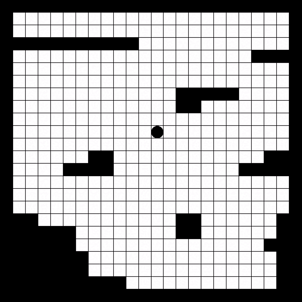

# ramon

Ramon is an environment to build and experiment with different path-planning algorithms.

The goal is to simulate the behaviour of a roomba robot in navigating and cleaning a room.

Ramon consists of an EDSL, which allows you to describe an algorithm for a roomba to clean a room, and an environment to run and visualise simulations of that algorithm over different possible rooms.


## Types

### Orientation

```
data Orientation = N | S | E | W | NE | NW | SE | SW
```  


## EDSL  

### move

Moves the robot one tile in the direction it is facing


### moveN (n :: Int)

Moves the robot `n` tiles in the direction it is facing


### turn (o :: Orientation)

Turns the robot in the specified orientation


## Examples

This example shows the robot moving 2 tiles in the 4 cardinal directions, ultimately going in a circle.

```
turn N
moveN 2

turn E
moveN 2

turn S
moveN 2

turn W
moveN 2
```


